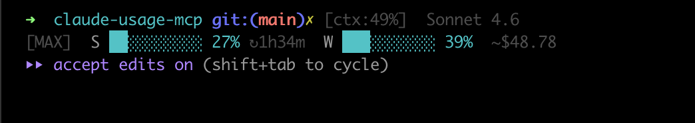

# ccpulse

> Real-time Claude Code usage in your terminal statusline



See your **session %**, **weekly %**, and **daily cost** — right where you work. No switching windows, no browser tabs.

---

## Why ccpulse?

[ccusage](https://github.com/ryoppippi/ccusage) is great for querying usage from the command line. ccpulse does something different: it **lives in your statusline**, updates automatically, and pulls the same accurate numbers you see on claude.ai.

| | ccusage | ccpulse |
|--|--|--|
| Source | Local JSONL logs (estimated) | OAuth API (exact same as claude.ai) |
| Interface | CLI command | Statusline (always visible) |
| Session % | ✗ | ✓ |
| Reset countdown | ✗ | ✓ |
| Auto-refresh | ✗ | ✓ (every 30s) |

---

## What you see

```
[MAX]  S ████████░░ 78%  ↻38m  W ████░░░░░░ 35%  ~$42.45
  │         │         │     │       │              │
  │         │         │     │       │              └─ Estimated daily cost
  │         │         │     │       └─ Weekly usage (all models)
  │         │         │     └─ Time until session resets
  │         │         └─ Current session %
  │         └─ Progress bar
  └─ Your plan (MAX / PRO / etc.)
```

Session and weekly % come directly from the Anthropic OAuth API — the same data source as the claude.ai usage dashboard.

---

## Install

### Prerequisites

- Node.js 18+
- [Claude Code](https://claude.ai/code) (with an active session)
- `jq` (`brew install jq`)

### 1. Clone & build

```bash
git clone https://github.com/ohsu77/ccpulse.git ~/ccpulse
cd ~/ccpulse
npm install
npm run build
```

### 2. Register as MCP server

Add to `~/.claude/mcp.json`:

```json
{
  "mcpServers": {
    "ccpulse": {
      "command": "node",
      "args": ["/Users/ohsu77/ccpulse/dist/index.js"]
    }
  }
}
```

### 3. Install the statusline script

```bash
cp statusline.sh ~/.claude/statusline-command.sh
chmod +x ~/.claude/statusline-command.sh
```

Edit the `REFRESH_SCRIPT` path in `~/.claude/statusline-command.sh` to match your install location:

```bash
REFRESH_SCRIPT="$HOME/ccpulse/dist/refresh.js"
```

### 4. Enable in Claude Code settings

Add to `~/.claude/settings.json`:

```json
{
  "statusLine": {
    "type": "command",
    "command": "~/.claude/statusline-command.sh"
  }
}
```

Restart Claude Code. You should see the usage bar on your next prompt.

---

## Configuration

Config file lives at `~/.claude-usage/config.json`. You can edit it directly, or use the MCP tool:

```
# Inside a Claude Code conversation:
use tool: set_plan
plan: max   # api | pro | max | max_5x | max_20x
```

### Plan options

| Plan | Description |
|------|-------------|
| `api` | API-only (no rate limits) |
| `pro` | Claude Pro |
| `max` | Claude Max |
| `max_5x` | Claude Max 5× |
| `max_20x` | Claude Max 20× |

---

## How it works

```
OAuth API (api.anthropic.com)
  → five_hour.utilization  = Session %
  → seven_day.utilization  = Weekly %
  → five_hour.resets_at    = Reset countdown
        +
JSONL (~/.claude/projects/*/*.jsonl)
  → tokens × price table  = Daily cost estimate
        ↓
~/.claude-usage/cache.json   ← written by MCP server / refresh.js
        ↓
~/.claude/statusline-command.sh  ← reads cache, renders bar
```

The statusline script checks cache age on every prompt. If the cache is older than 30 seconds, it spawns `refresh.js` in the background — so you never wait, and values stay fresh.

---

## Accuracy

- **Session % and Weekly %** are exact values from the Anthropic API, identical to what claude.ai shows.
- **Daily cost** is an estimate calculated from local JSONL token logs × model pricing. Pro/Max plans are billed as compute hours, not dollars — treat this as a rough gauge, not an invoice.
- The OAuth endpoint used (`/api/oauth/usage`) is undocumented and may change. If values stop updating, check for a new release.

---

## MCP Tools

ccpulse registers these tools with Claude Code:

| Tool | Description |
|------|-------------|
| `get_usage` | Get usage summary (daily / weekly / both) |
| `set_plan` | Update your plan config |
| `calibrate` | Record a web usage % for local token calibration |

---

## License

MIT © 2026
